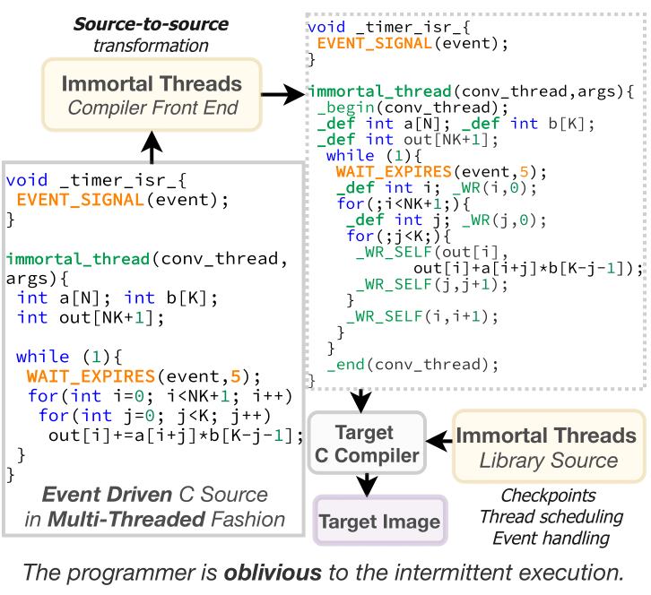
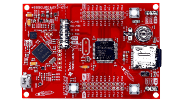

# OSDI 22' Artifact Evaluation for [ImmortalThreads](https://tinysystems.github.io/ImmortalThreads/)

[ImmortalThreads](https://tinysystems.github.io/ImmortalThreads/) is a novel programming model that brings pseudo-stackful multithreaded processing to intermittent computing. Programmers using Immortal Threads are oblivious to intermittent execution and write their applications in a multithreaded fashion using common event-driven multithreading primitives. Our compiler fronted transforms the stackful threads into stackless threads that waste a minimum amount of computational progress upon power failures. Our runtime implements fair scheduling to switch between threads efficiently.

<!--=========================================================================-->


The main components of ImmortalThreads system are [*immortalc*](./compiler) compiler fronted and [*immortalthreads*](./runtime/) runtime.

<p align="center">

</p>

Programmers using Immortal Threads are **oblivious** to intermittent execution, and they develop their programs in a multithreaded fashion **as they are programming a continuously powered system**.

 [*immortalc*](./compiler) compiler fronted compiler frontend  transforms the programmer's source code into stackless continuations that handle intermittency without programmer intervention. It transforms the stackful threads into stackless threads, inserts ultra-lightweight checkpointing mechanisms under the hood to minimize wasted progress and maintain the memory consistency.

[*immortalthreads*](./runtime/) runtime implements a preemptive scheduler to switch between threads and provides common event-driven primitives such as semaphores and blocking event wait operations.


## Roadmap for the Artifact Evaluation

1. You will experience developing an ImmortalThreads application using the generic interfaces exposed to the programmer by [*immortalthreads*](./runtime/) runtime library.
	- You will observe that you will be **completely oblivious** to the intermittency during the application development process. You will not reason about power failures, you will not manually insert checkpoints,
2.  You will use [*immortalc*](./compiler) compiler frontend, which will perform source-to-source transformation by instrumenting this application.
	- With this single step, you will have an intermittently-executable application source file that can be compiled and linked with the [*immortalthreads*](./runtime/) runtime library.
4.  You will generate the firmware and burn into the microcontroller to run this application.

You will also follow these steps (1--3) to instrument our benchmarks presented in the paper and run them on the microcontroller.


## Requirements

### Hardware Requirements
ImmortalThreads requires Texas Instruments MSP430FR series FRAM-enabled microcontrollers. Our evaluation is performed on [MSP430FR5994 LaunchPad Development Kit](https://www.ti.com/tool/MSP-EXP430FR5994).



To upload the firmware into the [MSP430FR5994 LaunchPad Development Kit](https://www.ti.com/tool/MSP-EXP430FR5994), you need to install [UniFlash](http://www.ti.com/tool/UNIFLASH) and use GUI to select the firmware to be loaded.

### Software requirements

ImmortalThread's code can be built using a preconfigured Docker container, without having to install the toolchain, but requires you to mount the directory of the project into the container.

* [Install Docker Desktop](https://docs.docker.com/get-docker/)

## Project Layout

```

├── ARTIFACT_EVALUATION.md
├── apps                     # Sample applications
├── compiler
│   ├── cmake                # CMake support functions
│   ├── src                  # Source code of immortalc
│   └── test                 # Snapshot tests for immortalc
├── Dockerfile
└── runtime
    ├── cmake                # CMake toolchains for cross-compiling
    ├── src                  # ImmortalThreads runtime library
    └── test                 # Test applications
        └── benchmarks       # Benchmark test applications
            ├── ar
            ├── bc
            ├── cuckoo
            └── dnn
```

<!--=========================================================================-->


## Getting Started

In order to develop or compile an application, the first step is to build and install  [*immortalc*](./compiler)   source instrumentation tool. Please follow the following steps to make ImmortalThreads environment ready to instrument and compile your applications. Most of the work can be done inside the provided Docker container.

The guide is written assuming a **Linux shell environment**, but it should be quite easy to adapt to other shells.

```sh
# First: cd to the root of this project

# Build the image
$ docker build -t immortalthreads .
# Start the Docker container and also share the current directory with the
# docker container, so that the build artifacts can also be accessible from the
# host machine, so that they can be flashed.
$ docker container run -v "${PWD}:${PWD}" -w ${PWD} --rm -it immortalthreads
```

### Build immortalc

Inside the docker container:

```sh
# Assuming you are on the root of the project directory
$ cd compiler
# Configure CMake
$ cmake -H. -Bbuild
# Build and install the source instrumentation tool system-wide (inside the container)
$ make -C build install
# You can pass also the `-j<jobs>` options to perform parallel compilation
$ make -C build install -j4
```
## Basic Application Development for ImmortalThreads

In [apps/sensing_example](./apps/sensing_example) directory, there is a sample sensing application implemented using ImmortalThreads. In this application an immortal threads waits for events from an interrupt handler. Events are faked using a periodic timer.

```c

/* ------- th_temp.c ------- */
// allocate an event
event_t e_Timer;

// define an immortal thread entry point function called SENSE_TEMP
immortal_thread(SENSE_TEMP, args) {
  /* sum of the sensed temperature values */
  uint32_t sum = 0;
  /* always init event before using it */
  EVENT_INIT(e_Timer);
  /* local buffer to hold event data */
  uint8_t buf[_EVENT_MAXBYTES];

  while (1) {
    // wait for event
    EVENT_WAIT(e_Timer, buf);
    sum += ((uint32_t *)buf)[0];
    __led_toggle(LED2);
    __led_toggle(LED1);
    // busy loop
    for (i = 0; i < 1000; i++)
      ;
  }
}
```

The lines of code above shows the contents of the [th_temp.c ](./apps/sensing_example/th_temp.c) file. As listed in [runtime/src/event.h](./runtime/src/event.h) file, each event is a variable of **event_t** type. The available event API is listed here:

| Event API | Explanation   |
|--|--|
| `void EVENT_INIT(event_t e);` | initializes an event  |
| `void EVENT_SET_TIMESTAMP(event_t e, uint32_t time);` | Set time stamp of the event |
| `uint32_t EVENT_GET_TIMESTAMP(event_t e);` | Get time stamp of the event |
| `uint8_t *EVENT_GET_BUFFER(event_t e);` | Get data buffer of the event |
| `void EVENT_SIGNAL(event_t e);`|Signal the event|
| `void EVENT_WAIT_EXPIRES(event_t e, uint8_t *buffer, uint32_t expiration_time);`|wait for an event within expiration time.|
| `EVENT_WAIT(e, buffer);` | Wait for an event without expirtation time.|


*SENSE_TEMP* thread initialises a timer event and blocks on it. When this event is signalled, it obtains the temperature value (in *buf*) and accumulates in *sum* variable. Finally it toggles the LEDs on the microcontroller.

Timer interrupt handler in [timer_event.c](./apps/sensing_example/timer_event.c), which signals the *e_Timer* event, is listed below:

```c
/* ------- timer_event.c ------- */
void __attribute__((interrupt(TIMER0_B0_VECTOR))) _TimerISR(void) {
  /* get data buffer of the event */
  uint32_t *buffer = (uint32_t *)_EVENT_GET_BUFFER(e_Timer);
  /* read the fake temperature and put it into the event data */
  *buffer = readTemp();
  /* set event timestamp */
  _EVENT_SET_TIMESTAMP(e_Timer, GETTIME());
  /* notify the thread waiting on the event */
  _EVENT_SIGNAL(e_Timer);
}

```

This timer interrupt handler is triggered when the timer (which is set using MSP430's internal timer peripheral) fires. The ISR puts a random value into the event buffer, sets the timestamp and signals the event *e_Timer*. This will unblock the *SENSE_TEMP* thread.

The listing below shows the [main.c](./apps/sensing_example/main.c) function of the application.

```c
/* ------- main.c ------- */
#define NUM_THREADS 1
immortal_thread_t threads[NUM_THREADS];

int main(void) {
  // ...

  // Init a thread with SENSE_TEMP as entry point. We don't need to pass
  // anything to the thread so the third argument is NULL.
  imt_thread_init(&threads[0], SENSE_TEMP, NULL);

  // Start the ImmortalThreads scheduler
  imt_run(threads, NUM_THREADS, true);
  return 0;
}
```

In the main entry, we create and initialise a thread using *imt_thread_init* function. Here, *threads* array holds the thread structure that will be used by the runtime to access thread data. *imt_run* starts the runtime execution.


### The build system configuration

The contents of the [apps/sensing_example/CMakeLists.txt](.apps/sensing_example/CMakeLists.txt) is listed below:

```cmake
...

set(IMMORTALTHREADS_RUNTIME_DIR ${CMAKE_CURRENT_LIST_DIR}/../../runtime)
set(IMMORTALTHREADS_COMPILER_DIR ${CMAKE_CURRENT_LIST_DIR}/../../compiler)

# Include the ImmortalThreads for the msp430 hardware target.
set(IMMORTALITY_PORT "msp430")
add_subdirectory(../../runtime "runtime")

# As normal in CMake, add an executable target (called "sensing_example") and
# its source file
add_executable(sensing_example
  main.c
  th_temp.c
  timer_event.c
  )
# Link to the ImmortalThreads runtime static library
target_link_libraries(sensing_example
  PRIVATE
  immortality::immortality
)
# Use the correct linker script
target_link_options(sensing_example
  PRIVATE
  # Specify custom linker script
  -T${IMMORTALTHREADS_RUNTIME_DIR}/src/port/msp430/linker.ld
  )

# Include the utility functions to use `immortalc` with CMake
include(${IMMORTALTHREADS_RUNTIME_DIR}/cmake/ImmortalCompiler.cmake)
# Create an "immortal" executable. This executable will have as sources the
# instrumented versions of the original source files
add_immortal_executable(
  sensing_example
  # Extra arguments to pass. `immortalc` is not able to automatically define
  # these macros, as the cross-compiler would do. So we need to tell
  # `immortalc` to define these macros when instrumenting the # source files
  EXTRA_ARGS -D__MSP430__ -D__MSP430FR5994__
  # timer_event.c contains functions that must not be instrumented
  IGNORE_SOURCES timer_event.c
  )
```

### To compile the application


```sh
# Assuming you're in the Docker environment and in the root of the project
$ cd apps/sensing_example/
$ mkdir build && cd build
$ cmake ../
$ make
# You should find the "sensing_example_immortal.out" binary in your current directory
```


### To burn the application

To upload an application install [UniFlash](http://www.ti.com/tool/UNIFLASH) and use GUI to select the binary in build folder.

### What will you see?

After the code starts running, you will see the red and green LEDs on on [MSP430FR5994 LaunchPad Development Kit](https://www.ti.com/tool/MSP-EXP430FR5994) are blinking. This means that the *SENSE_TEMP* thread unblocks since the timer ISR signals the timer event periodically. Try to push the RESET button on the MCU and you will see that the execution continues and the application progresses.

---

In [sem_example](./apps/sem_example), there is a sample application in which two threads synchronize via two semaphores and toggle their LEDs such that the two on-board LEDs are blinked in an alternate fashion.

```c
/* ------- th1.c ------- */
...

// semaphore defined in th2.c
extern sem_t thread_2_sem;
// allocate a semaphore
sem_t thread_1_sem;

immortal_thread(thread_1, args) {
  // initialize a semaphore
  SEM_INIT(thread_1_sem);

  while (1) {
    // wait for post from thread_2
    SEM_WAIT(thread_1_sem);
    __led_toggle(LED1);
    // busy loop
    for (i = 0; i < 1000; i++)
      ;
    // post to thread 2
    SEM_POST(thread_2_sem);
  }
}

```

The lines of code above shows an excerpt of the [th1.c](./apps/sem_example/th1.c) file. As listed in [runtime/src/sem.h](./runtime/src/sem.h) file, each semaphore is a variable of **sem_t** type. The available semaphore APIs are the same of a traditional binary semaphore and are listed here:

| Semaphore API | Explanation   |
|--|--|
| `void SEM_INIT(sem_t sem);` | Initialize a binary semaphore  |
| `void SEM_WAIT(sem_t sem);` | Wait on a semaphore |
| `void SEM_POST_ISR(sem_t sem);` | Post the semaphore from ISR |
| `void SEM_POST(sem_t sem);` | Post the semaphore from an immortal thread |


[th2.c](./apps/sem_example/th2.c) uses the semaphores in a similar fashion.

```c
/* ------- th2.c ------- */
...

immortal_thread(thread_2, args) {
  while (1) {
    // post thread 1
    SEM_POST(thread_1_sem);
    // wait for post from thread_1
    SEM_WAIT(thread_2_sem);
    __led_toggle(LED2);
    // busy loop
    for (i = 0; i < 1000; i++)
      ;
  }
}
```

The build system configuration and the build steps of this application are the same as the previous *sensing_example* application.

### What will you see?

After the code starts running, you will see the red and green LEDs on on [MSP430FR5994 LaunchPad Development Kit](https://www.ti.com/tool/MSP-EXP430FR5994) are blinking in order.  This means that the *thread_1* and  *thread_2* are unblocking each other during the execution. Try to push the RESET button on the MCU and you will see that the execution continues and the application progresses.

## Running Benchmarks

Our benchmarks in the paper can be found in [runtime/test/benchmarks/](./runtime/test/benchmarks/) folder. Each subfolder includes plain C implementations as well as the already instrumented versions.

To manually instrument the benchmark applications and generate the firmware, follow these steps inside the docker container:

```sh
# Assuming you are on the root of the project directory
$ cd runtime
# Configure CMake
$ cmake -H. -Bbuild -DCMAKE_BUILD_TYPE="Debug" -DIMMORTALITY_PORT="msp430"
# Build the benchmark firmwares
$ make -C build
# You can now find the built firmwares in build/bin
#
# * immortality-test-ar_immortal.out
# * immortality-test-cuckoo_immortal.out
# * immortality-test-bc_immortal.out
# * immortality-test-dnn_immortal.out
```

The build process automatically re-generates the instrumented source files using `immortalc`. This repositories already comes with the instrumented source files, but you can remove then and verify that `immortalc` re-generates them correctly.
You can also pass `VERBOSE=1` to `make` to see how `immortalc` is invoked to generate the instrumented files.

```sh
# Remove the instrumented source files
$ make -C build clean
# Re-generate them and re-build the firmwares using make in verbose mode
$ make -C build VERBOSE=1
```
### Firmware with Artificial Power Failures

By passing the option `-DIMMORTALITY_TEST_BENCHMARK_EXECUTION_MODE` to `cmake` it is possible to control the execution mode of the built firmwares. The supported values are:

* `continuous`: continuously-powered execution (without power failures)
* `intermittent`: intermittent execution (simulated power failures using a timer that soft-resets the microcontroller)

```sh
# Run these commands to build the intermittent firmwares
$ cmake -H. -Bbuild -DCMAKE_BUILD_TYPE="Debug" -DIMMORTALITY_PORT="msp430" -DIMMORTALITY_TEST_BENCHMARK_EXECUTION_MODE="intermittent"
$ make -C build
```


### Burning applications

To upload an application install [UniFlash](http://www.ti.com/tool/UNIFLASH) and use GUI to select the firmware in build/bin folder.

### What will you see?

After you burn the application, the MCU starts running. If the **Green LED** on [MSP430FR5994 LaunchPad Development Kit](https://www.ti.com/tool/MSP-EXP430FR5994) turns on, this means that the application successfully finished its execution and outputted the correct results. if **Red LED** is on in the end, this means the application outputted incorrect results.

## Acknowledgments

<a href="https://www.unitn.it/"></a> <a href="https://ege.edu.tr/"></a>

## Copyright

MIT Licence or otherwise specified. See [license](./LICENSE.txt) file for details.
